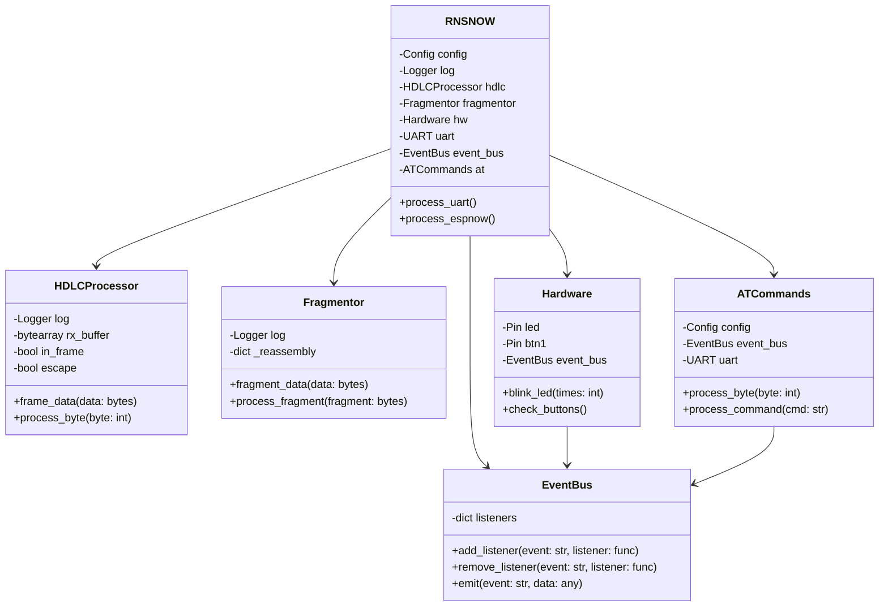
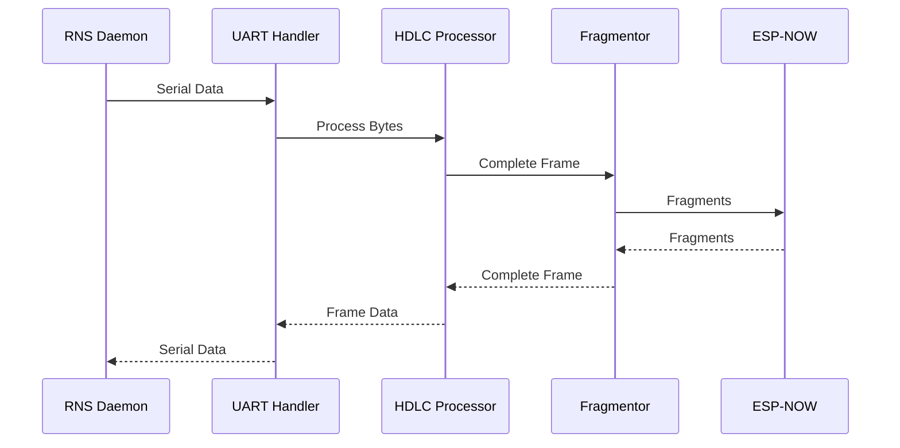
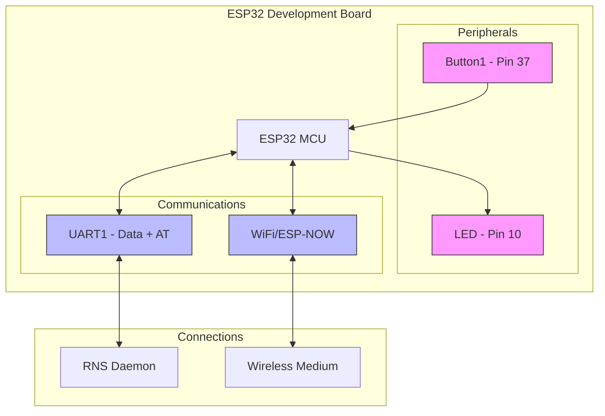

# 📡 RNS Interface ESP-NOW 

ESP32-based wireless interface for [Reticulum Network Stack](https://github.com/markqvist/Reticulum) using ESP-NOW.

## ⚠️ Current Status

This code is functional and ready for testing. Core features are implemented:

- 🎯 HDLC framing of serial data
- 📻 ESP-NOW transport with packet fragmentation and reassembly
- 🔧 Configuration via `AT` commands
- 💾 Persistent configuration storage

## 🤔 Why?

[ESP-NOW](https://github.com/espressif/esp-now) provides a hardware interface for Reticulum networks:

- 🏗️ No infrastructure required - direct peer-to-peer
- 🚀 High bandwidth (up to 1Mbps) 
- ⚡ Low latency (<4ms)
- 💰 Built into most ESP32 (~$5)
- 🧩 Works with `SerialInterface`

## 🐍 Why MicroPython?

MicroPython provides ideal characteristics for RNS ESP-NOW interface development:

- Interactive REPL and runtime execution enables fast prototyping and testing
- Directly aligns with Reticulum's Python codebase, allowing shared patterns
- AsyncIO enables efficient concurrent I/O handling
- Clear, readable code structure

### 📸 Flashing

First steps first:

* MicroPython needs to be [flashed](https://docs.micropython.org/en/latest/esp32/tutorial/intro.html) to the ESP32
* The [mpremote](https://github.com/micropython/micropython/tree/master/tools/mpremote) tool is recommended for device management and file operations.

## 🌐 System Design

The system utilizes an event-driven architecture with components communicating through a lightweight event bus.

### 📍 Core Components

### 🎬 Events

The system responds to several core events:

- **Control Events**: Channel changes (`ch_ch`), baudrate changes (`ch_bd`)
- **Hardware Events**: Button presses, LED signals
- **Network Events**: ESP-NOW transmission/reception, ping requests/responses
- **Configuration Events**: Settings changes via AT commands

### 🔌 UART Processing

- Single UART interface for both data and AT commands
- Configurable pins and baud rate
- `AT` command set for configuration
- HDLC frame processing for RNS packets

### 📻 ESP-NOW Transport 

- WiFi station mode (no AP needed)
- Group broadcast approach
- Long range mode support
- Packet fragmentation for RNS MTU compliance

## 🔄 Data Flow

## 👾 Hardware

The interface uses a minimal hardware configuration:

## 📡 Configuration

The device can be configured via AT commands:

- `AT` - Test command
- `ATI` - Show device info  
- `AT&F` - Factory reset
- `AT&V` - View config
- `AT&W` - Write config
- `AT+DESC=text` - Set description
- `AT+BAUD=rate` - Set baudrate
- `AT+CHAN=n` - Set WiFi channel (1-14)
- `AT+MAC=xxxxxxxxxxxx` - Set target MAC
- `AT+LOG=n` - Set log level (0-4)
- `AT+PROTO=type` - Set protocol (default/lr)
- `AT+PINS=name,val - Configure pin (name: led/button1/button2/tx/rx, val: pin number or NONE)`
- `AT+RESET` - Reset device

Settings are stored in `config.json` and persist across reboots.

## 🎯 Development Target

While this interface should work on any ESP32-based platform, current development and testing is being done exclusively on ESP32-S3 based boards. Development is ongoing and testing with other ESP32 platforms will follow as the project matures.

## 🤝 Contributing

Contributions welcome! Please:
- 🐛 Report bugs
- 💡 Suggest features  
- 🔧 Submit pull requests
- 📢 Share your experiences

## 🎫 Sponsor

This work is supported by the [Critical Decentralisation Cluster (CDC)](https://decentral.community/) - thank you very much!

## 📄 License

MIT License - See LICENSE file for full details.

## 🖇 References

- https://github.com/espressif/esp-now
- https://docs.espressif.com/projects/esp-faq/en/latest/application-solution/esp-now.html
- https://github.com/espressif/esp-now/blob/master/User_Guide.md
- https://docs.micropython.org/en/latest/library/espnow.html
- https://github.com/micropython/micropython-lib/blob/master/micropython/aioespnow/aioespnow.py