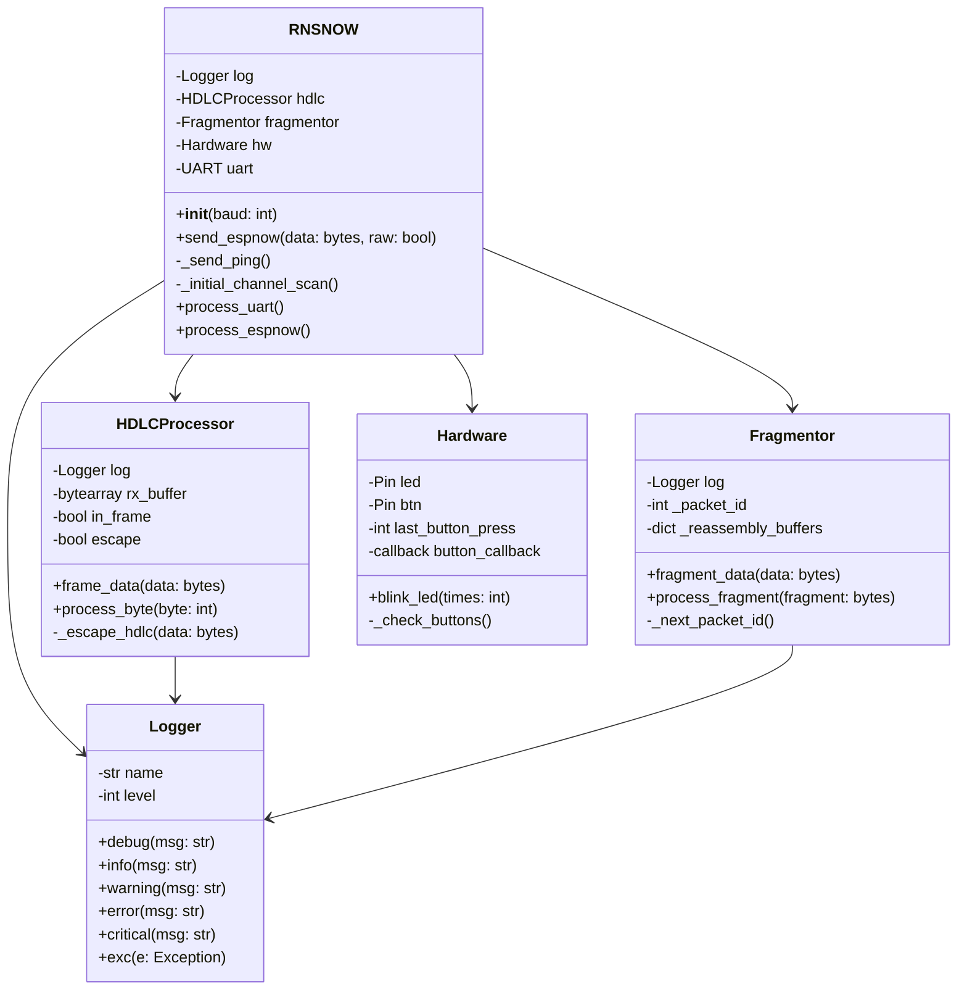
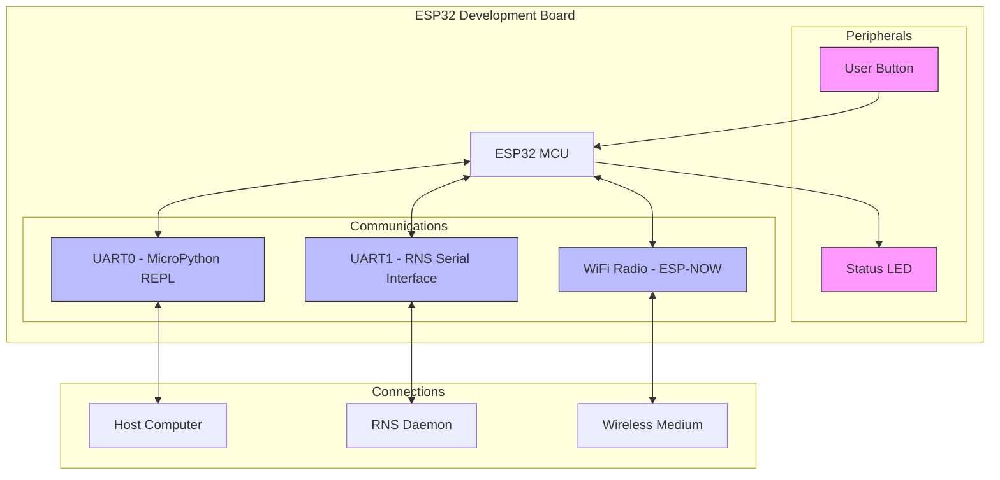

# 📡 RNS Interface ESP-NOW

ESP32-based wireless interface for [Reticulum Network Stack](https://github.com/markqvist/Reticulum) using ESP-NOW.

## ⚠️ Current Status

This code is under active development and not yet ready for general use. While core functionality works, some features need testing and optimization:

- ⚡ Power management strategies
- 📻 Long range mode behavior
- 🎯 Channel selection refinement
- 🌊 Network congestion handling

## 🤔 Why?

[ESP-NOW](https://github.com/espressif/esp-now) provides an elegant and efficient transport layer for Reticulum networks:

- 🏗️ No infrastructure required - direct peer-to-peer
- 🚀 High bandwidth (up to 1Mbps)
- 📡 Long range capability with ESP32
- ⚡ Low latency (<4ms)
- 💰 Built into most ESP32 (~$5)
- 🧩 Simple protocol design
- ⚙️ Zero configuration needed

## 🐍 Why MicroPython?

MicroPython provides ideal characteristics for RNS ESP-NOW interface development:

- **Rapid Development**: Interactive REPL and runtime execution enables fast prototyping and testing without compilation cycles
- **Python Ecosystem**: Directly aligns with Reticulum's Python codebase, allowing shared implementation patterns and code reuse
- **Performance**: AsyncIO enables efficient concurrent I/O handling for UART and ESP-NOW operations

### 📸 Flashing

Before starting, MicroPython needs to be [flashed](https://docs.micropython.org/en/latest/esp32/tutorial/intro.html) to the ESP32. The [mpremote](https://github.com/micropython/micropython/tree/master/tools/mpremote) tool is recommended for device management and file operations.

## 🌐 System Design

### Modules



Framing is done using [`HDLC`](https://en.wikipedia.org/wiki/High-Level_Data_Link_Control) from/to Reticulum.

### 🔌 UART Processing
- [Interfaces](https://github.com/markqvist/Reticulum/blob/master/RNS/Interfaces/SerialInterface.py) with Reticulum daemon (`rnsd`)
- Configurable pins and baud rate
- Handles frame buffering and delimiting

### 📻 ESP-NOW Transport
- WiFi station mode (no access point needed - "ad hoc")
- Group broadcast approach (think `VLAN`)
- Long range mode enabled (needs testing)
- Power management optimized (also needs testing)
- Channel scanning for automatic peer discovery

## 🔄 Data Flow

### UART to ESP-NOW
1. Buffer serial data
2. Process complete frames
3. Broadcast via ESP-NOW

### ESP-NOW to UART
1. Receive broadcasts
2. Handle special frames (ping/probe)
3. Forward regular frames to UART

## 👾 Hardware

Simply put, it's very simple 😉



> Due to the lack of `CDC` support but on the `rpi` ports of MicroPython we have to use two UARTs. This may change in the future.

## 📡 RF Characteristics 

### Bandwidth & Performance

Real-world performance varies significantly based on environment and settings:

- **Standard Mode**
  - Open environment: ~214 Kbps
  - Ideal conditions: ~555 Kbps 
  - Maximum PHY rate: 1 Mbps

- **Long Range Mode**
  - 250K mode: ~150 Kbps practical
  - 500K mode: ~300 Kbps practical
  - Actual throughput depends heavily on environment

- **Packet Size**
  - Maximum payload: 250 bytes
  - Limited by IEEE 802.11 vendor action frame spec
  - Larger transfers must be split into multiple packets

Performance can be optimized by:
- Finding optimal channel with least interference
- Using appropriate antenna placement
- Balancing range vs speed requirements
- Implementing efficient packet fragmentation
- Choosing appropriate retry strategies

### 🚇 Long Range Mode

ESP-NOW on ESP32 supports a special long range (LR) mode that extends communication range at the cost of bandwidth. When enabled:

- PHY rate drops to 512Kbps or 256Kbps
- Range can increase by up to 2-3x compared to standard mode
- Signal penetration through obstacles improves
- More robust in noisy RF environments
- Power consumption increases slightly

The tradeoff between range and speed could be configured through the ESP-NOW API:

```c
esp_wifi_config_espnow_rate(WIFI_IF_STA, WIFI_PHY_RATE_LORA_250K);  // Longest range
esp_wifi_config_espnow_rate(WIFI_IF_STA, WIFI_PHY_RATE_LORA_500K);  // Balanced
```

> Unfortunately, setting rate requires IDF>=4.3.0 which MicroPython currently does not support.

## 🔍 Network Discovery

### 📡 Channel Selection
1. Scan preferred channels first
2. Send probes, count responses
3. Select best channel
4. Eventually fall back to default

### 📦 Special Frames
- `GROUP_ID` prefixed:
    - `PING`: Connectivity test
    - `PROBE`: Channel scanning
    - `ACK`: Probe response

## 🎯 Development Target

While this interface should work on any ESP32-based platform, current development and testing is being done exclusively on the [M5StickC Plus](https://docs.m5stack.com/en/core/m5stickc_plus). Development is ongoing and testing with other ESP32 platforms will follow as the project matures.

Technical specifications and setup instructions currently assume the M5StickC Plus hardware configuration. When using other ESP32 boards, you may need to adjust pin assignments and hardware-specific settings accordingly.

## 🤝 Contributing

Contributions welcome! Please:
- 🐛 Report bugs
- 💡 Suggest features
- 🔧 Submit pull requests
- 📢 Share your experiences

## 🎫 Sponsor

This work is supported by the [Critical Decentralisation Cluster (CDC)](https://decentral.community/) - thank you very much!

## 📄 License

MIT License - See LICENSE file for full details.

## References

- https://github.com/espressif/esp-now
- https://docs.espressif.com/projects/esp-faq/en/latest/application-solution/esp-now.html
- https://github.com/espressif/esp-now/blob/master/User_Guide.md
- https://docs.micropython.org/en/latest/library/espnow.html
- https://github.com/micropython/micropython-lib/blob/master/micropython/aioespnow/aioespnow.py
- https://github.com/glenn20/micropython-espnow-utils


